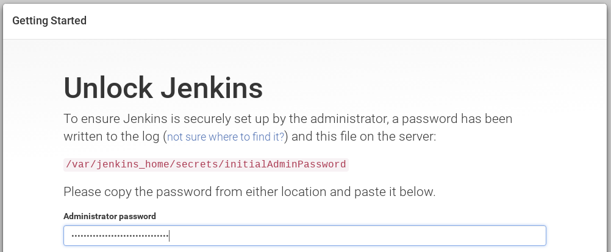
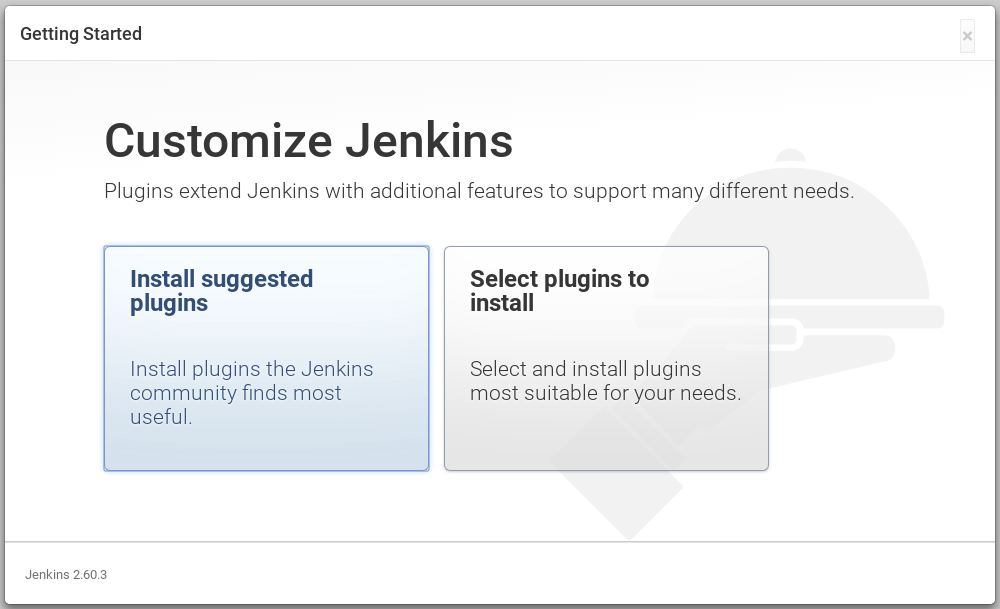
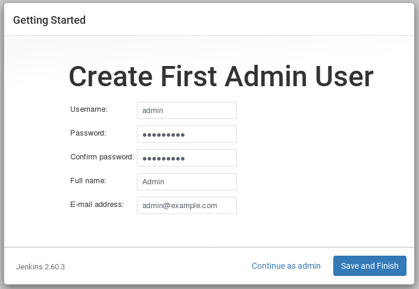
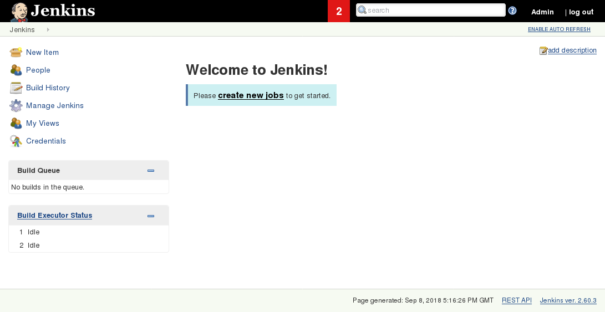
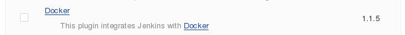

In this step we will run a new instance of Jenkins using a Docker container. After that we will install and configure the Docker plugin. The plugin is based on a Jenkins Cloud plugin. When a build requires Docker, it will create a "Cloud Agent" via the plugin. The agent will be a Docker Container configured to talk to our Docker Daemon.

The Jenkins build job will use this container to execute the build and create the image before being stopped. The Docker Image will be stored on the configured Docker Daemon. The Image can then be pushed to a Docker Registry ready for deployment.

## Task

### Launch Jenkins

Launch a new Jenkins instance as a Docker Container with the following command:

```docker run -d --name jenkins -p 8080:8080 -p 50000:50000 jenkins:alpine```{{execute}}

Port 8080 opens the Jekins web dashboard, 50000 is used to communicate with other Jenkins agents. Finally, the image has an alpine base to reduce the size footprint.

You can monitor the startup logs of Jenkins with:

```docker logs -f jenkins```{{execute}}

To detach from the console, press CTRL+C.

### Load Dashboard

You can load Jenkins dashboard via the following URL https://[[HOST_SUBDOMAIN]]-8080-[[KATACODA_HOST]].environments.katacoda.com/



The username is **admin** and the password can be found from the output of the below command. On the terminal execute;

```docker exec -it jenkins cat /var/jenkins_home/secrets/initialAdminPassword```{{execute}}

It may take a couple of seconds for Jenkins to finish starting and be available.

### Initial Jenkins Configuration

The first time you login to a new Jenkins instance, you are prompted to preset Jenkins configuration.

* Choose **Install Suggested Plugins**
  
  

* Wait until all plugins are installed.
* Fill the **Create First Admin Form** with the below:

  * Username: admin
  * Password: qwe123edc
  * Full name: Jenkins Admin
  * Email: admin@example.com

  

* Submit the form by clicking **Save and Finish**, and click on **Start using Jenkins**.

You will be redirected to Jenkins Dashboard.



### Install Docker Plugin

Now you'll use the dashboard to configure the plugins and start building Docker Images.

* Within the Dashboard, select **Manage Jenkins** on the left.
* On the Configuration page, select **Manage Plugins**.
* Manage Plugins page will give you a tabbed interface. Click **Available** to view all the Jenkins plugins that can be installed.
* Using the search box, search for **Docker**. There are multiple Docker plugins, select **Docker** using the checkbox.

  

* Click **Install without Restart** at the bottom.
* The plugins will now be downloaded and installed. Once complete, click the link **Go back to the top page**.

Your Jenkins server can now be configured to build Docker Images.
