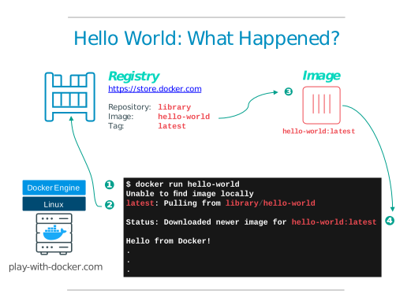

## Containers are created from Images

A **container** is the runtime instance of an image, it's what the image becomes in memory when executed (that is, an image with state, or a user process). You can see a list of the running containers with the command, ```docker container ls```, just as you would in Linux.

A **container** runs _natively_ on Linux and shares the kernel of the host machine with other containers. It runs a discrete process, taking no more memory than any other executable, making it lightweight.

By contrast, a **virtual machine** (VM) runs a full-blown “guest” operating system with _virtual_ access to host resources through a hypervisor. In general, VMs provide an environment with more resources than most applications need.

## Test Docker Version

Use ```docker version```{{execute}} to ensure that you have a supported version of Docker.

Use ```docker info```{{execute}} to view even more details about the docker installation.

## Run Docker Containers

A container is launched by running an image. An **image** is an executable package that includes everything needed to run an application--the code, a runtime, libraries, environment variables, and configuration files. The command to run a container is ```docker container run <IMAGE>```. For example:

```docker container run hello-world```{{execute}}

causes the Docker engine running in the terminal to find an **image** named hello-world. Since you just got started there are no images stored locally (`Unable to find image 'hello-world:latest' locally`) so Docker engine goes to its default **Docker registry**, which is Docker Store, to look for an image named “hello-world”. It finds the image there, pulls it down, and then runs it in a container. And hello-world’s only function is to output the text you see in the terminal, after which the container exits.



If you are familiar with VMs, you may be thinking this is pretty much just like running a virtual machine, except with a central repository of VM images. And in this simple example, that is basically true. But as you go through these exercises you will start to see important ways that Docker and containers differ from VMs. For now, the simple explanation is this:

* The VM is a hardware abstraction: it takes physical CPUs and RAM from a host, and divides and shares it across several smaller virtual machines. There is an OS and application running inside the VM, but the virtualization software usually has no real knowledge of that.
* A container is an application abstraction: the focus is really on the OS and the application, and not so much the hardware abstraction. Many customers actually use both VMs and containers today in their environments and, in fact, may run containers inside of VMs.

**Where's our container?**

* Our container is now in a stopped state.
* It still exists on disk, but all compute resources have been freed up.
* We will see later how to get back to that container.

To find out the running containers on the system, use;

```docker container ls```{{exeucte}}

This will not return the container which we ran previously, because the container is in the stopped state. To find out all the containers that are currently running and stopped on the system, use;

```docker container ls -a```{{execute}}
