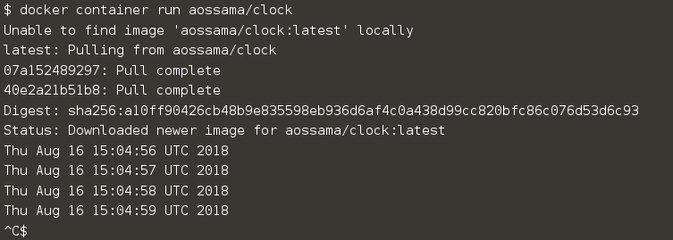
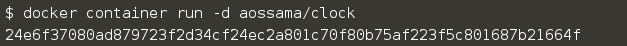

Docker containers are built from images. A container keeps running as long as the process it started inside the container is still running. There are different ways to use containers. These include:

* **Run a single task**: This could be a shell script or a custom application
* **Interactively**: This connects you to the container similar to the way you SSH into a remote server
* **In the background**: For long-running services like websites and databases

In this step We will see how to:

* Run an interactive container
* Run a non-interactive container
* Run a container in the background

## Task

### An Interactive Container

Interactive containers are useful for testing purposes and help in the process of image creation without worrying about the resources. To run an interactive container, use;

```docker container run --interactive --tty --rm ubuntu /bin/bash```{{exeucte}}

In this illustration, you'll notice that we executed a command `/bin/bash` in a new container based on the `ubuntu` image. This caused docker to pull the `ubuntu:latest` image and create a new container. The `--interactive` and `--tty` instructs docker to **keep STDIN open** and **allocate a pseudo-TTY** for the container.

When containers stop they remain on the system in a **stopped** state, the `--rm` instructs docker to **remove** the container after it has been stopped.

There are lots of options to be used when **running** container, use ```docker container run --help``` to inspect all the options that can be used.

### A Non-Interactive Container

While interactive containers are useful for some purposes, developers and operations might want to run non-interactive container for other purposes. In this example we will run a container which displays the time every second in the foreground.

```docker container run aossama/clock```{{execute}}



* This container will run forever
* To stop it, press `Ctrl+C`
* Docker has automatically downloaded the image `aossama/clock`
* This image is a user image, created by `aossama`
* We will hear more about user images (and other types of images) later

And inspect the containers using ```docker container ls -a```{{execute}}

### Background Containers

Containers can be started in the background. This is the mostly used way to run containers. You run containers in the background with the `-d` flag (**daemon mode**):

```docker container run -d aossama/clock```{{execute}}



* We don't see the output of the container.
* But don't worry: Docker collects that output and logs it!
* Docker gives us the ID of the container.

And inspect the containers using ```docker container ls -a```{{execute}}