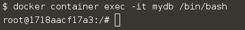
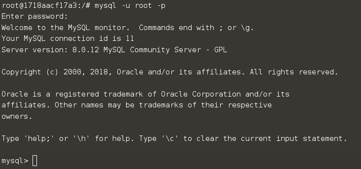

Now that we have explored some areas behind running and managing containers, it's time to run more realistic scenario. In this example:

* We will run a MySQL database container called **mydb**
* Inspect the container logs
* Connect to the container from another container

## Task

### Find the MySQL Image

The first task is to identify the name of the Docker Image which is configured to run MySQL. With Docker, all containers are started based on a Docker Image. These images contain everything required to launch the process; the host doesn't require any configuration or dependencies.

You can find existing images at registry.hub.docker.com/ or by using the command ```docker search <name>```. For example, to find an image for MySQL, you would use;

```docker search mysql```{{execute}}

### Run the MySQL Container

Using the search command, you have identified that the MySQL Docker Image is called **mysql** and want to run the **latest** release. Because MySQL is a database, you want to run it as a background service while you resume your work.

Background containers are how you'll run most applications. To complete this step, launch a container in the background running an instance of MySQL based on the official image.

```docker container run --detach --name mydb --env MYSQL_ROOT_PASSWORD=my-secret-pw mysql:latest```{{execute}}

Notice that to specify a name for the container you use **--name mydb**, omitting this option causes docker to generate a random name for the container. You also used a new option **--env MYSQL_ROOT_PASSWORD=my-secret-pw** which defines an environment variable in the containers context.

As this is the first time you use the MySQL image, it will be downloaded onto the Docker Host machine.

### Find the MySQL Container

The launched container is running in the background, the ```docker container ls``` command lists all running containers, the image used to start the container and uptime. This command also displays the specified name and ID that can be used to find out information about individual containers.

### Inspect the MySQL Container

The command ```docker container inspect <friendly-name|container-id>``` provides more details about a running container, such as IP address.

```docker container inspect mydb```{{execute}}

The command ```docker container logs <friendly-name|container-id>``` will display messages the container has written to standard error or standard out.

```docker container logs mydb```{{execute}}

This will output lots of lines, which are basically the logs from the application running inside the container and the processes running inside the container:

```docker container top mydb```{{execute}}

Although MySQL is running, it is isolated within the container because no network ports have been published to the host. Network traffic cannot reach containers from the host unless ports are explicitly published.

### Accessing MySQL

Now that our MySQL database is up and running, we need to access it. If a service needs to be accessible by a process not running in a container, then the port needs to be exposed via the Host. Once exposed, it is possible to access the process as if it were running on the host OS itself. We know that by default, MySQL runs on port 3306.

Attach to the `mydb` container with ```docker container exec -it mydb /bin/bash```{{execute}}



Which will open a new shell inside the `mydb` container that enables to to access the database.

Connect to the database with:

```mysql -u root -p```{{execute}}

And enter the password which has been used earlier **my-secret-pw**. This will give you the access to the MySQL database;



Exit the MySQL shell using ```exit```{{execute}} and from the container shell using ```exit```{{execute}}