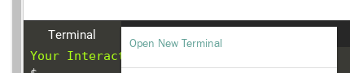

NGINX is an open source software for web serving, reverse proxying, caching, load balancing, media streaming, and more. In this step we'll run an Nginx webserver and expose some static content from this server.

## Task

### Find and Pull Nginx Image

```docker search nginx```{{execute}}

Pull the image;

```docker image pull nginx```{{execute}}

You do not need to run pull everytime you want to run a container as `docker container run` will automatically pulls the image from the registry if it does not find it in the local images.

### Run nginx Container

Use the below command to run the nginx webserver and attach to the foreground;

```docker container run --name webserver -p 8000:80 nginx:latest```{{execute}}

Navigate to the URL https://[[HOST_SUBDOMAIN]]-8000-[[KATACODA_HOST]].environments.katacoda.com/ to see the default index page of the webserver.

You'll notice that the container is attached to the foreground and the container logs are shown as you browse the URL. To run a container in the background use `-d` option.

### Run a custom container image

Run another nginx container, but this time with different content. For the demostration of this step we've prepared a simple HTML application that we'll be using it's content inside a container.

Open a new tab by clicking on the **+** sign beside the **Terminal** tab;



Clone the repository for the HTML application;

```git clone https://github.com/aossama/simple-html-app.git .```{{execute}}

Build a new image and base it on top of the nginx container, and add our HTML application to the new image. We'll also tag the new image with 1.0.

```docker image build -t my-simple-html:1.0 .```{{execute}}

Run the new image;

```docker container run -p 8001:80 --name my-simple-app my-simple-html:1.0```{{execute}}

And navigate to the URL https://[[HOST_SUBDOMAIN]]-8001-[[KATACODA_HOST]].environments.katacoda.com/ to see the application's index page served from the newly created container.

### Run new version

Now let's modify our application a little bit and run a new version of the application in a new container based on a newly built image;

```git checkout new-version```{{execute}}

And build a new image, and add the new HTML application content to it. This time we will tag the new image with 1.1 to differentiate it from the old image.

```docker image build -t my-simple-html:1.1 .```{{execute}}

And run the new image;

```docker container run -p 8002:80 --name my-new-simple-app my-simple-html:1.1```{{execute}}

And navigate to the URL https://[[HOST_SUBDOMAIN]]-8002-[[KATACODA_HOST]].environments.katacoda.com/ to see the new application's index page served from the newly created container.

### Inspect the nginx Container

The command ```docker container inspect <friendly-name|container-id>``` provides more details about a running container, such as IP address.

```docker container inspect mydb```{{execute}}

The command ```docker container logs <friendly-name|container-id>``` will display messages the container has written to standard error or standard out.

