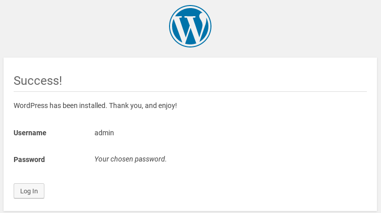

We will start this lab with building a Wordpress website. WordPress is a free and open-source content 
management system based on PHP and MySQL.

## Task

### Create MySQL Container

Start off by creating a new MySQL database container:

```docker container run -d --name wordpress-database --env MYSQL_ROOT_PASSWORD=qwe123edc mysql```{{execute}}

Wait about 1 minute until the database is fully initialized then create a new auxiliary container. This 
container will be linked to the database container using the option `--link`. `--link` option create a link 
from one container to another container using names. This types of containers is often called **side-car** 
container because it's doing a side job for the main container.

```docker container run -it --rm --link wordpress-database:wordpress-database --name blaa mysql mysql -u root -p -h wordpress-database```{{execute}}

The above command will result in creating a new container and opening the MySQL CLI in your terminal.

### Configure Database

We need to create a new database for Wordpress, first create the database with;

```create database wordpress;```{{execute}}

Then create the user which will be used by the Wordpress server to connect to the database;

```create user 'wordpress'@'%' identified by 'qwe123edc';```{{execute}}

And grant the new user full access on the wordpress database;

```grant all privileges on wordpress.* to 'wordpress'@'%';```{{execute}}

Finally exit from the side-car container;

```quit```{{execute}}

### Create Wordpress Container

Now start a new Wordpress container and link it to the main database container;

```docker container run -d --link wordpress-database:wordpress-database --name wordpress --publish 8000:80 wordpress```{{execute}}

### Install Wordpress

Navigate to http://[[HOST_SUBDOMAIN]]-8000-[[KATACODA_HOST]].environments.katacoda.com/ which will 
show you the installer of Wordpress.

* First choose installation language

  

* Confirm information collection

  

* Configure database parameters

  

* Run the installer

  

* Fill in the admin information

  

* Log in

  

Now you can access your new Wordpress installation over URL http://[[HOST_SUBDOMAIN]]-8000-[[KATACODA_HOST]].environments.katacoda.com/