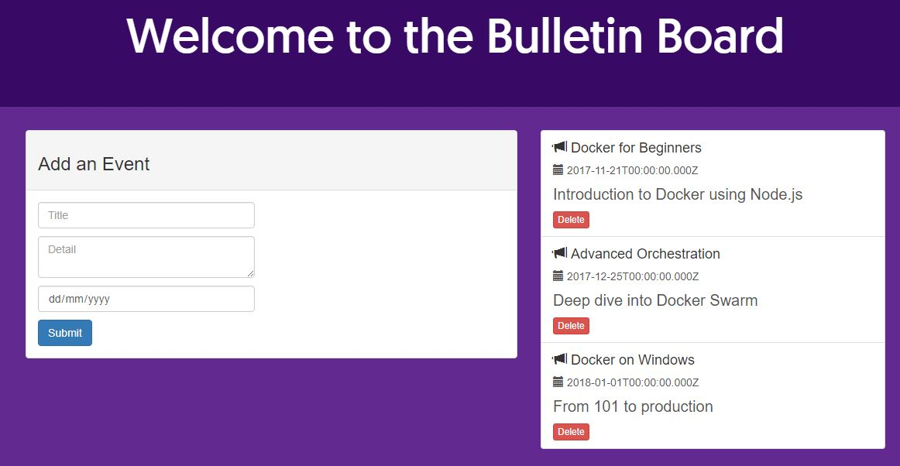

## Task

You will need:

* a copy of the application source code
* a Docker account

### Clone the source code from GitHub

Use the following command to clone the application source code from GitHub (you can click the command or manually type it). This will make a copy of the lab's repo in a new sub-directory called node-bulletin-board.

```git clone https://github.com/aossama/node-bulletin-board.git```{{execute}}

And browse to the source code folder;

```cd node-bulletin-board/```{{execute}}

### Save your Docker Account

You need a Docker account to push your images to Docker Hub. If you don't have one, create a free Docker account at Docker Hub (https://hub.docker.com/).

Now save your Docker account in an environment variable - **you need to type this command manually with your own Docker account**:

```export dockerId='your-docker-id'```

<pre>Be sure to use your own Docker account. Mine is **aossama**, so the command I run is export dockerId='aossama'.</pre>

Check your Docker ID gets displayed when you read the variable:

```echo $dockerId```{{execute}}

### Run v1 of the app in a container

The first version of the application uses a single container, running the Node.js application, and the data is only stored on the client's browser. Switch to the v1 source code branch:

```git checkout v1```{{execute}}

Now build the Docker image, which uses a Dockerfile to package the source code on top of the official Node.js image:

```docker image build --tag $dockerId/bb-app:v1 --file bulletin-board-app/Dockerfile ./bulletin-board-app```{{execute}}

When that completes you will have version 1 of the app in an image stored locally. Run a container from that image to start the app:

```docker container run --detach --publish 8080:8080 $dockerId/bb-app:v1```{{execute}}

Docker will start a container from the application image, which runs `npm start` to start the app. You can browse to the application on port 8080:

[Click here for v1 of the app](https://[[HOST_SUBDOMAIN]]-8080-[[KATACODA_HOST]].environments.katacoda.com/)

You'll see the bulletin board application, and you can add and remove events:



If you make some changes and refresh the browser, you'll see your changes get lost. That's because the events are only stored in memory on the client.

In the next step you'll fix that.