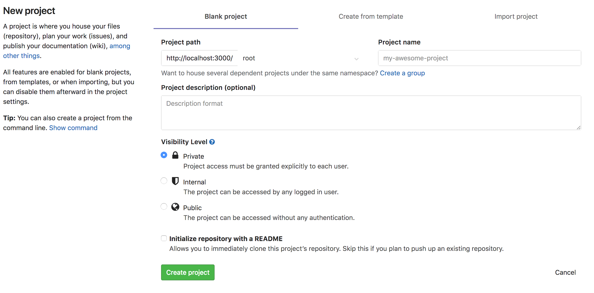
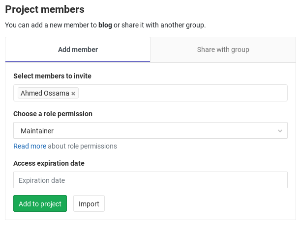

GitLab is a self service hosted platform which enables you to create your own projects, administer the access to the 
repositories you own, create continous integration and delivery pipelines and more functions without the need to get 
back to operations team.

## Projects

In GitLab, you can create projects for numerous reasons, such as, host your code, use it as an issue tracker, 
collaborate on code, and continuously build, test, and deploy your app with built-in GitLab CI/CD. Or, you can do it 
all at once, from one single project.

Projects can be available publicly, internally, or privately, at your choice. GitLab does not limit the number of 
private projects you create.

### Create a Project in GitLab

1. In your dashboard, click the green New project button or use the plus icon in the upper right corner of the navigation bar.

   

2. This opens the New project page.

   

3. Provide the following information:

4. Click Create project.

When you create a project in GitLab, you'll have access to a large number of features:

  * Repositories
  * Issues tracker
  * Merge Requests
  * GitLab CI/CD
  * Wiki
  * Code Snippets

### Administer Project Members

You can manage the groups and users and their access levels in all of your projects. You can also personalize the access 
level you give each user, per-project.

1. From the project dashboard, go to your project's `Settings` > `Members`.

2. Right next to `Select members to invite`, start typing the name or username of the user you want to add.

3. Select the user and the permission level that you'd like to give the user. Note that you can select more than one user.

  
  
4. Optionally you can set an expiration date for this user. The user access will be revoked after the specified date.

5. Once done, hit Add users to project and they will be immediately added to your project with the permissions you gave them above.

You can refer to [GitLab Permissions](https://docs.gitlab.com/ee/user/permissions.html) to see the difference between each user permission.

## Outcome

You have created a new project which can be used to collaborate your local git repository to it.