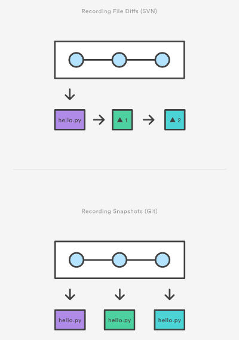

To save, or commit, files into your Git repository you first need to add them to the index area. Git has three areas, a working directory, a index area and the repository itself. Users move, otherwise referred to as promote, changes from the working directory, to a index area before committing them into the repository.

One of the key approaches with Git is that commits are focused, **small and frequent**. The index area helps to maintain this workflow by allowing you to only promote certain files at a time instead of all the changes in your working directory.

## Git commit vs SVN commit

While they share the same name, `git commit` is nothing like `svn commit`. This shared term can be a point of confusion for Git newcomers who have a svn background, and it is important to emphasize the difference. To compare `git commit` vs `svn commit` is to compare a centralized application model (svn) vs a distributed application model (Git). In SVN, a commit pushes changes from the local SVN client, to a remote centralized shared SVN repository. In Git, repositories are distributed, Snapshots are committed to the local repository, and this requires absolutely no interaction with other Git repositories. Git commits can later be pushed to arbitrary remote repositories.

## Task

### Add files to the index / `git add`

The `git add` command adds a change in the working directory to the staging area. It tells Git that you want to include updates to a particular file in the next commit. However, git add doesn't really affect the repository in any significant way—changes are not actually recorded until you run git commit.

In conjunction with these commands, you'll also need git status to view the state of the working directory and the staging area. Use the command ```git add <file|directory>``` to add files or directories to the index area. For example, use;

```git add README.md index.html```{{execute}}

This command updates the index using the current content found in the working directory tree, to prepare the content staged for the next commit. It typically adds the current content of existing paths as a whole, but with some options it can also be used to add content with only part of the changes made to the working tree files applied, or remove paths that do not exist in the working tree anymore.

The "index" holds a snapshot of the content of the working tree, and it is this snapshot that is taken as the contents of the next commit. Thus after making any changes to the working tree, and before running the commit command, you must use the add command to add any new or modified files to the index.

The ```git status``` command can be used to obtain a summary of which files have changes that are staged for the next commit.

```git status```{{execute}}

## Git add VS SVN add

The git add command should not be confused with svn add, which adds a file to the repository. Instead, git add works on the more abstract level of changes. This means that git add needs to be called every time you alter a file, whereas svn add only needs to be called once for each file. It may sound redundant, but this workflow makes it much easier to keep a project organized.



### Save changes to the repository / `git commit`

Once a file has been added to the index area it needs to be committed to the repository. The command ```git commit -m "commit message"``` moves files from index to the repository and records the time/date, author and a commit message that can be used to add additional context and reasoning to the changes such as a bug report number.

Only changes added to the index area will be committed, any files in the working directory that have not been staged will not be included.

To commit the staged file use;

```git commit -m "Initial commit"```{{execute}}

Examine the result of this action by using the ```git status``` command;

```git status```{{execute}}

## Protip

* Each commit is assigned a SHA-1 hash which enables you to refer back to the commit in other commands.
* The ```git status```{{execute}} command allows you to view the state of both the working directory and index area at any point in time.
