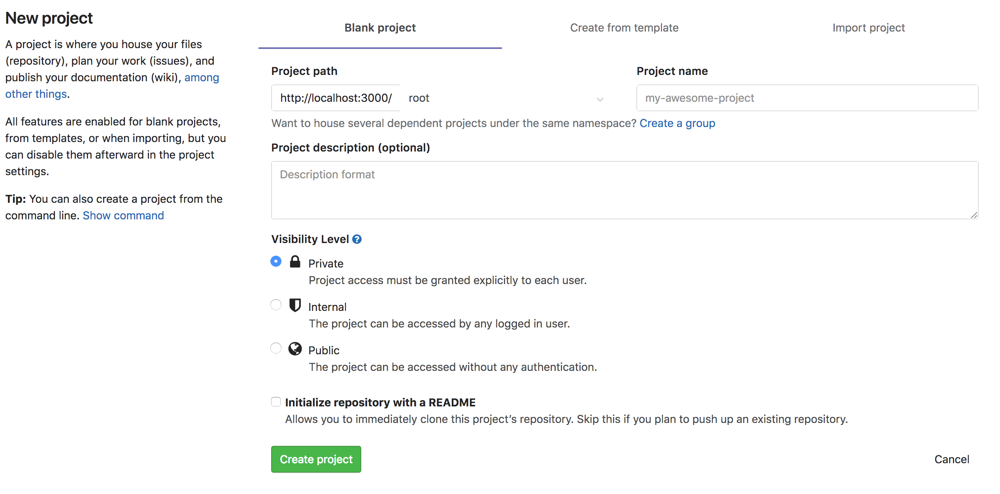

GitLab is a self service hosted platform which enables you to create your own projects, administer the access to the 
repositories you own, create continous integration and delivery pipelines and more functions without the need to get 
back to operations team.

## Groups

With GitLab Groups you can assemble related projects together and grant members access to several projects at once. Groups can also be nested in subgroups.

### Use cases

You can create groups for numerous reasons. To name a few:

* Organize related projects under the same _namespace_, add members to that group and grant access to all their projects at once
* Create a group, include members of your team, and make it easier to `@mention` all the team at once in issues and merge requests
  * Create a group for your company members, and create subgroups for each individual team. Let's say you create a group called company-team, and among others, you created subgroups in this group for each individual team backend-team, frontend-team, and production-team:
    1. When you start a new implementation from an issue, you add a comment: "@company-team, let's do it! @company-team/backend-team you're good to go!"
    2. When your backend team needs help from frontend, they add a comment: "@company-team/frontend-team could you help us here please?"
    3. When the frontend team completes their implementation, they comment: "@company-team/backend-team, it's done! Let's ship it @company-team/production-team

## Projects

In GitLab, you can create projects for numerous reasons, such as, host your code, use it as an issue tracker, 
collaborate on code, and continuously build, test, and deploy your app with built-in GitLab CI/CD. Or, you can do it 
all at once, from one single project.

Projects can be available publicly, internally, or privately, at your choice. GitLab does not limit the number of 
private projects you create.

### Create a Project in GitLab

1. In your dashboard, click the green **New project** button or use the plus icon in the upper right corner of the navigation bar.

   

2. This opens the **New project** page.

   

3. Provide the following information:

   * Project name: simple-html-project
   * Project description: My simple HTML Project
   * Visibility Level: Public

4. Click **Create project**.

When you create a project in GitLab, you'll have access to a large number of features:

  * Repositories
  * Issues tracker
  * Merge Requests
  * GitLab CI/CD
  * Wiki
  * Code Snippets

### Sync repository remotely

Now that you've created an empty project on GitLab, you can now track the local repository to a remote one which can be used to collaborate work within a team.

In order to sync your repository to the remote one, you'll need to add the remote repository;

```git remote add origin http://git.itworx.cloud/<username>/simple-html-project.git```

And use the `git push` command to send your changes remotely;

```git push -u origin master```{{execute}}

## Outcome

You have created a new project which can be used to sync your local git repository to it.