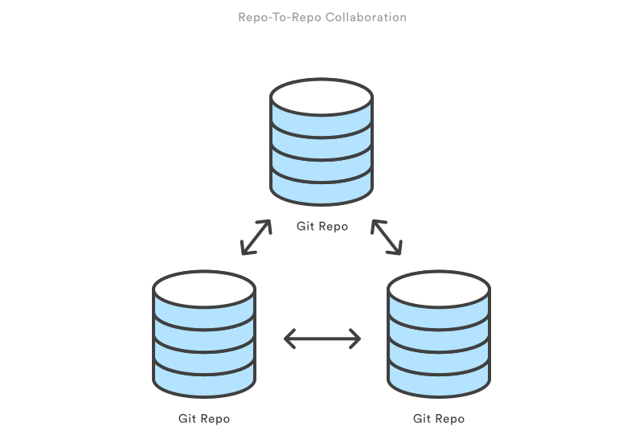

Here we'll examine the git clone command in depth. git clone is a Git command line utility which is used to target an existing 
repository and create a clone of the target repository. If a project has already been set up in a central repository, 
the `git clone` command is the most common way for users to obtain a development copy.

Like `git init`, cloning is generally a one-time operation. Once a developer has obtained a working copy, all version control 
operations and collaborations are managed through their local repository.

The `git clone` clones a repository into a newly created directory, creates remote-tracking branches for each branch in the 
cloned repository (visible using `git branch -r`), and creates and checks out an initial branch that is forked from the cloned 
repository's currently active branch.

## Repo-to-repo collaboration

It's important to understand that Git's idea of a "working copy" is very different from the working copy you get by checking out 
code from an SVN repository. Unlike SVN, Git makes no distinction between the working copy and the central repository—they're all 
full-fledged Git repositories.


This makes collaborating with Git fundamentally different than with SVN. Whereas SVN depends on the relationship between the 
central repository and the working copy, Git’s collaboration model is based on repository-to-repository interaction. Instead 
of checking a working copy into SVN’s central repository, you push or pull commits from one repository to another.



## Task

Use the command `git clone <repo>` to clone a repository into a newly created directory. For example;

```git clone https://github.com/aossama/simple-html-app.git```{{execute}}

will create a new directory called `simple-html-app` from the upstream repository 
`https://github.com/aossama/simple-html-app.git`

As a convenience, cloning repositories automatically creates a remote connection called **origin** pointing back to the 
original repository. This makes it very easy to interact with a central repository. This automatic connection is 
established by creating Git refs to the remote branch heads under `refs/remotes/origin` and by initializing 
`remote.origin.url` and `remote.origin.fetch` configuration variables.

## Protip

* To clone the repository located at `<repo>` into the folder called `<directory>` using the command `git clone <repo> <directory>`.
