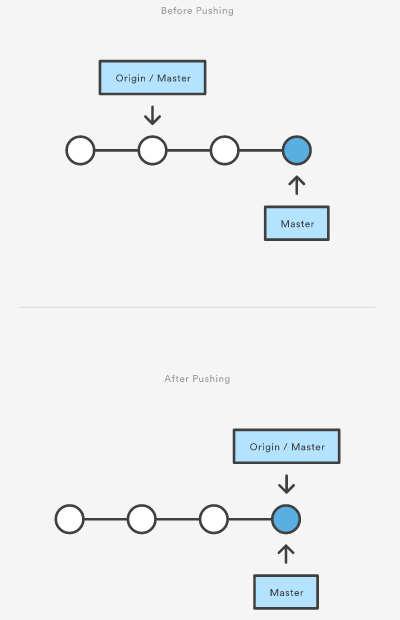

The ```git push``` command is used to upload local repository content to a remote repository. Pushing is how you transfer 
commits from your local repository to a remote repo. It's the counterpart to ```git fetch```, but whereas fetching imports 
commits to local branches, pushing exports commits to remote branches. Remote branches are configured using the ```git remote``` 
command. Pushing has the potential to overwrite changes, caution should be taken when pushing.

## Git push discussion

`git push` is most commonly used to publish an upload local changes to a central repository. After a local repository 
has been modified a push is executed to share the modifications with remote team members.



The above diagram shows what happens when your local master has progressed past the central repository’s master and you 
publish changes by running git push origin master. Notice how git push is essentially the same as running git merge master 
from inside the remote repository.

## Task

When you have your project at a point that you want to share, you have to push it upstream. The command for this is 
simple: `git push -u <remote> <branch>`. If you want to push your master branch to your origin server (again, cloning 
generally sets up both of those names for you automatically), then you can run this to push any commits you've done 
back up to the server using:

```git push -u origin --all```{{execute}}

Which will push all branches to the **origin** remote repository.

Navigate back to your GitLab project http://git.itworx.cloud/<username>/simple-html-app.git and you will see the changes  
in the repository.