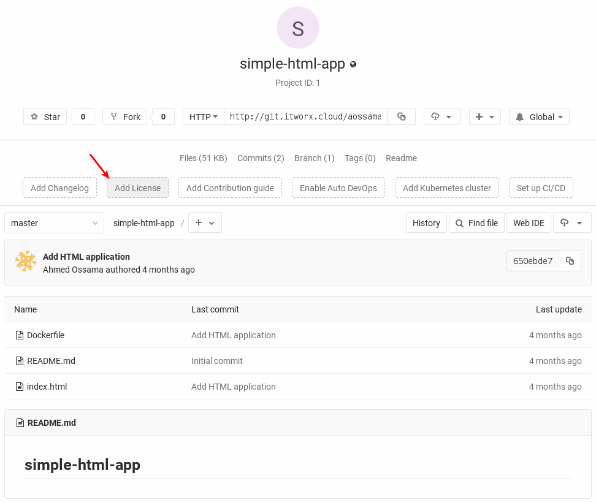
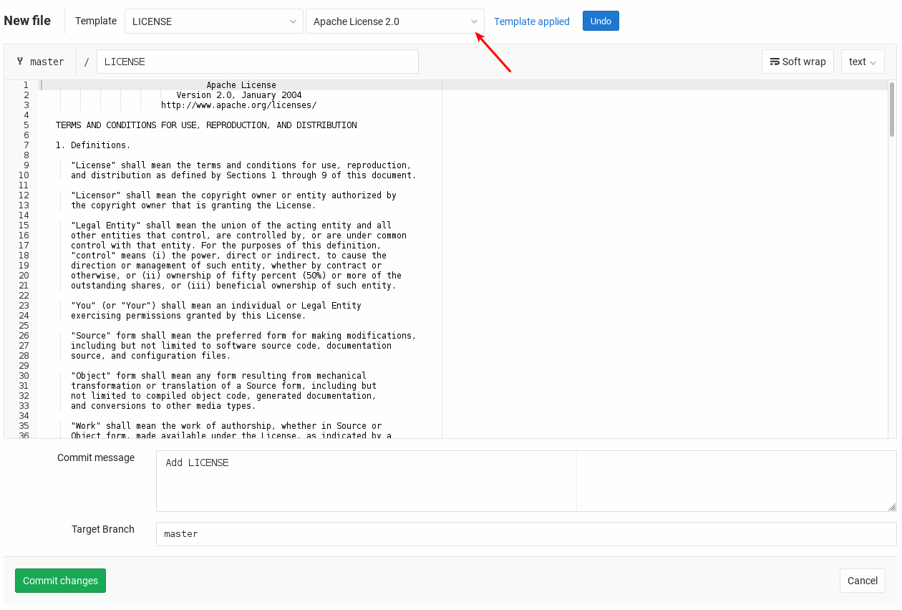

The `git fetch` command downloads commits, files, and refs from a remote repository into your local repo. Fetching 
is what you do when you want to see what everybody else has been working on.

It's similar to `svn update` in that it lets you see how the central history has progressed, but it doesn't force 
you to actually merge the changes into your repository. Git isolates fetched content as a from existing local content, 
it has absolutely no effect on your local development work. Fetched content has to be explicitly checked out using the 
git checkout command. This makes fetching a safe way to review commits before integrating them with your local repository.

## Task

### Introduct some changes

1. Navigate to your upstream repository on GitLab server http://git.itworx.cloud/<username>/simple-html-app.git
2. Add new **License** file by clicking on the **Add License** button. This will open a text editor for entering the license context of your project.



3. Go ahead and choose **Apache License 2.0** from the **Template** dropdown menu.



4. Push the **Commit changes** button.

This will introduct some new changes on your remote repository that are not yet tracked by your local repository.

### Fetch the updates

To get latest refs and content from your remote projects, you can run ```git fetch origin```{{execute}}. Which will typically result in an output like:

<pre>
remote: Enumerating objects: 4, done.
remote: Counting objects: 100% (4/4), done.
remote: Compressing objects: 100% (3/3), done.
remote: Total 3 (delta 0), reused 0 (delta 0)
Unpacking objects: 100% (3/3), done.
From http://git.itworx.cloud/aossama/simple-html-app
   650ebde..1459192  master     -> origin/master
</pre>

The command goes out to that remote project and pulls down all the data from that remote project that you don't have 
yet. After you do this, you should have references to all the branches from that remote, which you can merge in or 
inspect at any time.

### Inspect the difference

If you check the working tree using ```ls```{{execute}} you will not find the remote changes (the LICENSE file). 
Instead you've fetched the updates from the remote repository and applied them to the local tracking branch. 

Now let's check the difference between the _local branch_ and the _tracking branch ref_ repository. Use;

```git diff master origin/master```{{execute}}

This will diff between the local master branch and the remotely tracked master branch from origin. It will typically show 
the newly added license file.

### Apply fetched changes

Incorporates changes from the remote tracking branch in the local branch using:

```git merge origin/master```

Inspect the working directory by ```ls```{{execute}} reveals that the LICENSE file has been added to the working directory.

## Protip

* `git fetch` only download objects and refs from another repository, but does not apply to the working tree. It can be 
considered a safer, nondestructive version than `git pull`.