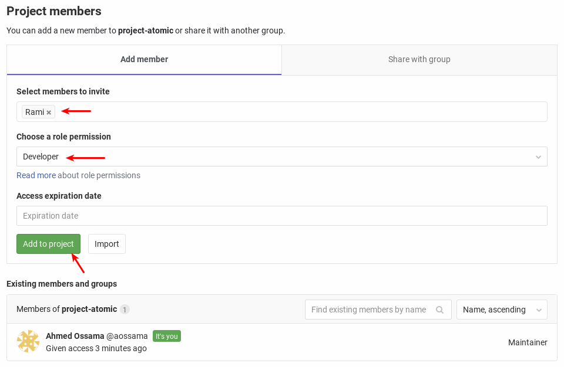

Collaborating work and managing projects with bare Git SCM is not a simple task. Optimally you'll need a platform to 
manage your project.

GitLab is a fully integrated software development platform that enables you and your team to work cohesively, faster, 
transparently, and effectively, since the discussion of a new idea until taking that idea to production all the way 
through, from within the same platform.

## Task

### Create New Project

1. In your dashboard, click the green **New project** button or use the plus icon in the upper right corner of the navigation bar.
2. This opens the **New project** page.
3. Provide the following information:

   * Project name: project-atomic
   * Project description: Yet another simple HTML application
   * Visibility Level: Private
   * Check "Initialize repository with a README"

4. Click **Create project**.

### Add CHANGELOG, LICENSE and CONTRIBUTING.md

When you initialize a new repository, the best practice is to add some files which describes your project, such as;

* CHANGELOG which is used to track changes
* LICENSE which tells the world what is the copyright of your source code
* CONTRIBUTING.md which describes to them how to contribute to your project

1. Add new **License** file by clicking on the **Add License** button. This will open a text editor for entering the license context of your project.
2. Choose **Apache License 2.0** from the **Template** dropdown menu.
3. Push the **Commit changes** button.

Do the same for CHANGELOG and CONTRIBUTING.md.

### Manage Project Memebers

1. Navigate to **Settings** then **Members**
2. Under the **Add member** section, provide the following information:
   You can read more about role permissions on http://git.itworx.cloud/help/user/permissions

   * Select members to invite: "Choose your other team member"
   * Choose a role permission: Developer

   

3. Click **Add to project**
